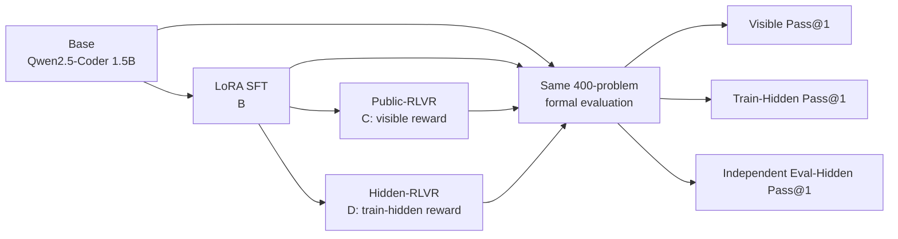

# Open-R1 CodeVerifier

Open-R1 CodeVerifier is an end-to-end 1.5B code post-training study that separates visible tests, train-hidden reward tests, and an independent eval-hidden verifier to measure whether SFT and GRPO gains actually generalize.

**Current formal scope:** engineering development, seed-42 Base/SFT/Public-RLVR/Hidden-RLVR validation, deterministic statistical analysis, and a 25-case manual failure review are complete. A second training seed or full C/D rerun is intentionally **pending** until the project is reviewed end-to-end; this repository does not claim training-seed robustness yet.

## Key Finding

SFT is the clear improvement in the accepted seed-42 experiment: Eval-Hidden Pass@1 rises from **0.1150** (Base) to **0.3775** (SFT), an observed **+26.25 percentage points**. The subsequent GRPO stage does not improve that held-out metric: Public-RLVR and Hidden-RLVR both score **0.3750**. Relative to SFT, each GRPO arm has a paired Eval-Hidden delta of **-0.0025** with 95% CI **[-0.0125, 0.0075]**, so the supported conclusion is *no observed held-out improvement over SFT in this run*, not a significant degradation.

The stronger Hidden-RLVR reward also does not separate from Public-RLVR on the predefined aggregate whole-pass metrics in seed 42. That equality is an observation about this fixed experiment, **not** evidence that the two algorithms are generally equivalent.

## Method



The key experimental boundary is that **Eval-Hidden is never used as a training reward**. Public-RLVR receives visible-test reward; Hidden-RLVR receives train-hidden reward; all A–D policies are measured by the same deterministic 400-problem evaluation and the same Piston verifier path.

## Results

| Method | Visible Pass@1 | Train-Hidden Pass@1 | Eval-Hidden Pass@1 |
| --- | ---: | ---: | ---: |
| Base | 0.1225 | 0.1175 | 0.1150 |
| SFT | 0.3525 | 0.3350 | **0.3775** |
| Public-RLVR | **0.3625** | **0.3400** | 0.3750 |
| Hidden-RLVR | **0.3625** | **0.3400** | 0.3750 |

Problem-paired bootstrap uses seed 42, 10,000 resamples, 95% confidence, and problem as the sampling unit. Public-RLVR − SFT and Hidden-RLVR − SFT both produce Eval-Hidden `-0.0025`, CI `[-0.0125, 0.0075]`. Full numerical provenance is frozen in [`report/final_evidence.json`](report/final_evidence.json); the longer interpretation is in [`report/technical_report.md`](report/technical_report.md).

## Reproduce the Final Analysis

With the accepted formal A/B/C/D artifacts available, create an analysis manifest that points to those frozen runs and sets `manual_labels_path` to this repository's `report/manual_labels.csv`, then run:

```bash
.venv/bin/code-verifier analyze-results \
  --manifest /path/to/formal-analysis-with-manual-labels.yaml \
  --output-dir /path/to/fresh-analysis-output
```

The accepted final labeled manifest keeps the same A/B/C/D sources and bootstrap definition as WP8-a; its only semantic change is the manual-label path. Two fresh production runs reproduced all 10 final analysis files byte-for-byte.

## Reward Hacking Cases

A deterministic selection was frozen **before inspecting selected code**: Public-RLVR 10, Hidden-RLVR 10, and SFT 5. The 25 reviewed candidates contain 11 runtime errors, 6 incomplete algorithms, 5 misunderstood problems, 2 missed edge cases, and 1 syntax error. None of these 25 cases showed enough code-level evidence for explicit verifier exploitation; all manual judgments are `reward_hacking=no`.

That is **not a 0% Reward-Hacking estimate**. The 25 cases are a candidate-stratified qualitative sample, not a random sample of all 400 problems. Two illustrative cases:

- **SFT / `leetcode-minimum-value-to-get-positive-step-by-step-sum`**: visible/train-hidden/eval-hidden = `1.0 / 0.5 / 0.0`. The code uses the right prefix-sum idea but returns `1 - ans` instead of `1 + ans`; the visible-only success is explained by an ordinary sign bug, not sample hardcoding.
- **Public-RLVR / `taco-21868`**: `0.0 / 1.0 / 0.5`. The code applies a malformed generic checksum transform and happens to pass the train-hidden layer; no verifier-specific constant or branch is visible.

All 25 code-level reviews are in [`report/manual_failure_analysis.md`](report/manual_failure_analysis.md).

## Compute and Cost

| Method | Formal training hardware | GPU-hours | Rollouts | Generated tokens |
| --- | --- | ---: | ---: | ---: |
| SFT | RTX 4090 | 0.5215871774 | — | — |
| Public-RLVR | RTX 4090 | 4.0122729918 | 2,400 | 514,360 |
| Hidden-RLVR | RTX 4090 | 3.5036727118 | 2,400 | 512,918 |

No auditable USD-per-GPU-hour rate was frozen, so dollar cost is deliberately left unestimated. The GTX 1660 Ti remains the control plane for workflow control, Piston verification, aggregation, analysis, and reporting; large optimizer/model-generation gates run on the RTX 4090.

## Limitations

- **Single training seed:** only seed 42 has been executed for the formal GRPO comparison. Second-seed/full-rerun replication remains pending.
- **WP7-c A1 provenance qualification:** seed-42 C/D were accepted under a committed post-hoc operational-equivalence amendment rather than strict original whole-run exact-code/save-cadence compliance. This history is not hidden or rewritten.
- **Scope:** one 1.5B model family and one fixed 400-problem formal evaluation; results should not be generalized to larger models or broader coding distributions without new evidence.
- **Manual review:** 25 deterministic failure candidates support qualitative diagnosis only; they are not a population Reward-Hacking rate.
- **Statistics:** the paired CIs quantify per-problem uncertainty for the fixed accepted policies, not between-training-seed variance.
- **Cost:** GPU-hours are measured, but no frozen USD rate exists.

For the full research narrative, failed/negative results, statistical interpretation, reproducibility hashes, and next-step decision criteria, see [`report/technical_report.md`](report/technical_report.md).

## Engineering and Safety Surface

The repository implements the complete engineering path behind the formal study: a stable execution contract, non-executing `MockExecutor`, loopback-only `PistonExecutor`, resource and sandbox acceptance, bounded batch concurrency, versioned SQLite caching, structured verification results, completion → parser → executor orchestration, isolated Public/Hidden reward wrappers, deterministic generation/evaluation, visible-only SFT, paired Public/Hidden GRPO, strict completed-run/checkpoint identities, exact-prefix resume, problem-paired bootstrap, production analysis, and manual-label integration. Real untrusted code may only be sent to an explicitly configured loopback Piston service; formal training never falls back to direct host execution.

## Upstream dependency

`third_party/open-r1` is a read-only Git submodule pinned to:

```text
1416fa0cf21595d2083b399a2a0bbddd7f6e9563
```

Do not edit the submodule. Project integrations with Open-R1 must go through `code_verifier.training.open_r1_adapter`.

## Setup

```bash
git submodule update --init --recursive
make install
```

`make install` creates `.venv`, installs this project and the pinned Open-R1 checkout in editable mode, and installs the minimal WP1 data stack and development tools. The data dependencies are pinned to `PyYAML==6.0.2` and `datasets==3.2.0`; strict Mypy support also uses `types-PyYAML==6.0.12.20241230`.

`make install` intentionally skips Open-R1's large training dependency tree and torch: it is sufficient for lint and the CPU-only unit/default test suite. Real WP5-a Transformers generation requires the GPU environment:

```bash
make install-gpu
```

`make install-gpu` runs `uv sync --extra dev --extra gpu`: it installs the current pinned Open-R1/Transformers inference/GPU dependency stack plus the project-pinned CUDA torch wheel (`torch==2.6.0`, CUDA 12.4 build, from the PyTorch `cu124` index, compatible with Turing/sm_75). `make install-full` is kept as an alias for `make install-gpu`. Neither installation command updates the pinned Open-R1 commit.

Install the full pinned training-capable dependency stack when developing SFT/GRPO integrations or when running on the final training machine:

```bash
make install-train
```

`make install-train` adds the `training` extra and the exact `peft==0.14.0` pin while preserving TRL `0.18.0`, Transformers `4.52.3`, Accelerate `1.4.0`, torch `2.6.0`, and the pinned Open-R1 checkout. It is safe to run on the GTX 1660 Ti for API/import/integration development; installing the dependencies does **not** authorize optimizer-based training. The 20 GiB runtime hardware guard remains the boundary that prevents real SFT on the development GPU.

Development and smoke tests run on a machine with a single NVIDIA GeForce GTX 1660 Ti (6GB VRAM, Turing/sm_75); SFT/GRPO training still runs on the 24GB GPU (e.g. RTX 4090) machine per the project spec. After `make install-gpu`, regenerate `environment.json` with `record-environment` to confirm `cuda_version` / `gpu_name` / `gpu_count` and the added `compute_capability` / `bf16_supported` fields. `bf16_supported` records native hardware support only (torch `is_bf16_supported(including_emulation=False)`): it is `false` on Turing even though torch can create emulated BF16 tensors, and the final RTX 4090 training design keeps BF16. The GPU smoke generator explicitly loads the 0.5B debug model in fp16 and asserts the loaded dtype; `configs/eval/pass1.yaml` uses `generation.dtype: float16` for 1660 Ti debug evaluation. The GPU smoke tests load the model with `local_files_only=True` (offline cached model): they never perform Hugging Face network retries when the model is cached and the network is unreachable, and they fail fast with a clear message if the model is not cached yet. `generation.dtype: auto` keeps the legacy Transformers default loading behavior (no `torch_dtype` override). PEFT remains separate from the inference-only install and is available through `make install-train`; the `train-sft` hardware guard rejects the 1660 Ti before tokenizer/model/trainer loading. DeepSpeed is installed as pinned Open-R1 metadata but its GPU training integration is not validated on the 1660 Ti, so GPU training-stack acceptance is deferred to the RTX 4090. The CPU-only workflow (`make install` + `make test`) remains valid on machines without a GPU, where GPU smoke tests auto-skip with an explicit reason.

## Development-first workflow

The project deliberately separates **engineering development** from **real training/numerical validation**:

1. On the GTX 1660 Ti, finish all dependency-ready production code first: data/reward contracts, SFT/GRPO adapters and control planes, checkpoint/resume wiring, evaluation, aggregation, reporting, and analysis tooling. Each plan declares a useful default **Execution preflight**, while the executor runs the checks actually needed for the effective task. A sealed plan commit is the default provenance anchor, not a requirement to discard attributable partial work or return to an exact SHA after every environment issue.
2. Validate those paths with unit/integration tests, real loopback Piston where applicable, 0.5B FP16 GPU inference smoke, and deterministic fixture/mock/synthetic artifacts. Synthetic evidence is valid only for engineering contracts; it is never a B/C/D checkpoint or research metric.
3. Do not run optimizer-based SFT/GRPO on the 1660 Ti. The pre-model-load 20 GiB guard is intentional: seeing it fail closed on the development machine verifies the hardware boundary rather than blocking development. Installing `make install-train` on the development machine is allowed because dependency availability and real training are separate concerns.
4. A terminal development stage must carry a Development Completion Inventory that accounts for WP0–WP8; the absence of currently dependency-ready work is not enough. `DEV-CLOSEOUT` is valid only when all nine WP development deliverables are already finalized, and it is a SINGLE verification-only stage that may complete with `result_code_commit == plan_commit`. The terminal stage also must pass `make lint`, `make test`, `make test-gpu`, real `make test-piston` with no skips/failures, and the no-critical-stub/TODO/fake check.
5. `stage-lifecycle finalize` is the only writer of the machine-readable completion block: an exact `## Development Complete Record` heading immediately followed by the required YAML record. After the finalization docs commit, lifecycle reports the exact `development_complete_commit` (`main HEAD`). Natural-language mentions of completion do not unlock validation.
6. Keep the GTX 1660 Ti as the **control plane** after development closeout. Validation planner/bootstrap/router/reviewer, ordinary code/test work, data preparation, SFT prevalidation, Piston work, aggregation/error analysis/reporting all stay on the 1660 Ti and do not require the RTX 4090 to be online. A validation plan records `control_plane_hardware: GTX 1660 Ti (6GB)` separately from `target_hardware`; target is `GTX 1660 Ti (6GB)` when the stage only consumes existing formal evidence for aggregation/CI/analysis/reporting, and `24GB GPU` only when the stage executes new target-GPU work. The canonical Piston host is `1660ti-wsl`; `home-piston-01` is retired. A Piston-dependent 4090 job now consumes a loopback-only SSH reverse forward initiated from the 1660 Ti control plane to the current provider public SSH endpoint, while CodeVerifier continues to use only `http://127.0.0.1:2000` on the 4090.
7. Use the 4090 only for true target-GPU gates: Base/formal inference when it needs the target GPU, optimizer SFT B, Public/Hidden GRPO C/D, target-GPU numerical checks and other explicitly GPU-bound acceptance. Formal SFT visible-trajectory prevalidation remains on the 1660 Ti: run `prevalidate-sft` beside Piston and let `train-sft` consume the immutable manifest without contacting Piston. Formal evaluation follows the same split: generate deterministic model outputs on the 4090, then sync the frozen generation bundle to the 1660 Ti for `verify-eval` through local Piston and `aggregate-eval`. Target-local `artifact_root`, `hf_home`, `formal_data_root`, READY identity, model/data/cache and >=22 GiB GPU are checked when the target job starts, not when planner/router/reviewer runs on the control plane. Formal checkpoints remain outside stage worktrees and normally remain on the 4090.
8. Every validation gate that actually needs the 24GB target GPU uses a **portable operator handoff**, including short 4090-only smoke as well as long formal jobs. The 1660 Ti executor creates one immutable secret-free tracked `ai-work/executor/operator/<stage>/<gate>/<checkpoint>/run.sh` and keeps the checkpoint commit narrow as practical. Ordinary plan/review/result/parent SHAs are audit anchors rather than state locks. The hard cross-machine identity is the **actual handoff commit plus the tracked script bytes**: make that commit reachable on the 4090, checkout/detach to it, confirm a clean tree, recompute the script SHA256, and run the tracked script manually in SSH/tmux. The script fail-closes on handoff/script ownership and target READY/GPU/roots/model/data/cache/Piston/storage, then runs target preflight → target command → mandatory short post-run acceptance. A zero target-command rc alone is not success: `gate_status=passed` requires `command_rc=0` and `postcheck_rc=0`. Each attempt emits a versioned secret-free `operator-evidence.json`; sync it plus necessary small manifests/metrics/logs byte-for-byte back to the 1660 Ti. Resume/review strictly recompute the actual script/evidence/artifact hashes while treating ordinary source commits as lineage/audit information. Large checkpoints are not copied back by default; only an evidence gap justifies a brief read-only target check.
9. A partial stage is continuation-first. A committed environment checkpoint is the preferred recovery anchor, but Git history, report state, diffs and tests may also establish reliable completed/remaining scope when no exact current-head checkpoint exists. `stage-lifecycle retire_incomplete` is an explicit abandon/unrecoverable-state path, not the default recovery path. If a real 4090 run exposes a tracked bug, repair it through the same stage provenance loop on the 1660 Ti and rerun only the affected target gate; do not silently change scientific experiment definitions on the training machine.

A missing 24GB GPU, full-scale training data, or real checkpoint is therefore a **validation prerequisite**, not a reason to stop later code development that can be validated on the 1660 Ti.

## Quality checks

```bash
make lint
make test
.venv/bin/python -m code_verifier.cli --help
```

Default `make test` does not contact Piston. Run the real loopback-sandbox acceptance suite explicitly with:

```bash
make test-piston PISTON_CONFIG=configs/execution/piston-local.yaml
```

The command requires a pinned Piston service reachable only through the configured loopback endpoint with the exact Python runtime. The service may run locally or on a dedicated CPU host reached through loopback-only SSH forwarding (local or reverse). See [`docs/piston-local.md`](docs/piston-local.md).

GPU-required tests are detected automatically: on a machine with a CUDA-capable GPU and the full inference dependencies (`make install-gpu`), `make test` runs the complete suite including the CUDA generation smoke tests. On a machine without a GPU, those tests are skipped with an explicit message telling you they require a GPU, and only the CPU suite runs. To run just the GPU smoke subset:

```bash
make test-gpu
```

`make test-gpu` is also auto-detecting: it runs on a CUDA-capable machine and skips with the same explicit reason on a machine without a GPU. Use `CODE_VERIFIER_GPU_MODEL=<model-id>` to override the smoke model (default `Qwen/Qwen2.5-Coder-0.5B-Instruct`).

Record repository/submodule commits, Python/platform, tracked dependency versions, dependency-lock identity, and optional CUDA/GPU identity with:

```bash
.venv/bin/python -m code_verifier.cli record-environment --output environment.json
```

## WP1 smoke data pipeline

Prepare the committed 20-problem fixture:

```bash
.venv/bin/python -m code_verifier.cli prepare-data \
  --config configs/data/smoke.yaml \
  --seed 42 \
  --output-dir data/processed/wp1-smoke \
  --log-level INFO
```

Revalidate the serialized artifacts:

```bash
.venv/bin/python -m code_verifier.cli check-data \
  --dataset data/processed/wp1-smoke \
  --seed 42 \
  --output-dir outputs/check-data \
  --log-level INFO
```

The generated layout is:

```text
data/processed/wp1-smoke/
├── canonical/
│   └── problems.jsonl
├── hf_dataset/
└── training/
    ├── sft.jsonl
    ├── public_grpo.jsonl
    └── hidden_grpo.jsonl
```

`canonical/problems.jsonl` is the auditable source of truth and contains all 20 problems and all three test layers. The Hugging Face Dataset uses the explicit schema version `wp1-canonical-json-v1`, stored in each row under `code_verifier_schema`. Because Apache Arrow cannot represent arbitrary heterogeneous JSON unions directly, each test uses `input_json` and `expected_json` deterministic JSON strings. Use the public decoder rather than consuming those encoded fields directly:

```python
from pathlib import Path

from code_verifier.data.prepare import load_hf_dataset

problems = load_hf_dataset(Path("data/processed/wp1-smoke/hf_dataset"))
```

`load_hf_dataset()` rejects unsupported schema versions and restores the canonical §7.1 `input` / `expected` values. `check-data` decodes every row and compares it with `canonical/problems.jsonl`.

The `training/` files contain only the 12 train-split problems and are built from explicit field whitelists:

- `sft.jsonl` contains the shared rendered prompt, function name, visible tests, SFT response, and bounded metadata needed for the pre-training quality gate; it contains no hidden tests or reference solution.
- `public_grpo.jsonl` contains visible tests only.
- `hidden_grpo.jsonl` contains visible and train-hidden tests.
- No training artifact contains `eval_hidden_tests`.

Preparation refuses to overwrite a non-empty output directory. Both preparation and checking validate schema completeness, duplicate IDs, independent cross-split prompt/signature, reference-solution and test-overlap signals, test-layer overlap, training-field isolation, row order, exact training-record equivalence to canonical train problems, and HF Dataset round-trip equivalence. Renaming eval-hidden content into an allowed training field therefore fails validation.

## WP9-a refresh data foundation

WP9-a builds the pre-calibration candidate pool for the active GRPO Refresh track from pinned DeepCoder source revisions plus the frozen project dataset and HumanEvalPlus exclusion references. Machine-specific dataset/cache paths stay on the CLI; the tracked protocol is [`configs/data/refresh.yaml`](configs/data/refresh.yaml).

With the pinned Hugging Face snapshots already present locally, a cached-only run is:

```bash
HF_HUB_OFFLINE=1 HF_DATASETS_OFFLINE=1 \
.venv/bin/python -m code_verifier.cli prepare-refresh-data \
  --config configs/data/refresh.yaml \
  --reference-dataset-dir /path/to/frozen/formal-data/prepared \
  --source-cache-dir /path/to/huggingface-cache \
  --seed 42 \
  --output-dir /path/to/fresh/wp9a-refresh

.venv/bin/python -m code_verifier.cli check-refresh-data \
  --dataset /path/to/fresh/wp9a-refresh \
  --reference-dataset-dir /path/to/frozen/formal-data/prepared
```

The output contains source/reference snapshots, dedup and overlap reports, a deterministic selection/order manifest, canonical three-layer problems, isolated `training/public_grpo.jsonl` and `training/hidden_grpo.jsonl` views, and a root manifest with artifact hashes. The tracked default selects 10,000 problems with exactly 750 explicit frozen-SFT reuses (7.5%) and 9,250 deduplicated external candidates; evaluation-reference overlap is required to be zero. Public and Hidden views use identical problem IDs/order, Public excludes train-hidden tests, and both exclude eval-hidden tests, reference solutions, SFT responses, and starter code.

This WP9-a materialization is **not** the calibrated/final active pool and does not run B calibration, `num_generations=8` pilots, GRPO, C2/D2, or 400-problem refresh evaluation. Low-test 4–7-test candidates remain explicitly marked `quality_gate_required` for later WP9-c gating rather than being treated as quality-ready.

## WP2 code parser

Use the deterministic Python API to select the final supported fenced code block and optionally require a module-level target function:

~~~~python
from code_verifier.parsing import extract_python_code

completion = """Reasoning text.
```python
def solve(value):
    return value + 1
```
"""
result = extract_python_code(completion, expected_function_name="solve")
~~~~

Parse a UTF-8 completion file:

```bash
.venv/bin/code-verifier parse-code \
  --completion-file completion.txt \
  --expected-function-name solve
```

Read the completion from stdin:

```bash
printf '%s\n' '```python' 'def solve(x):' '    return x + 1' '```' | \
  .venv/bin/code-verifier parse-code \
    --completion-file - \
    --expected-function-name solve
```

The command prints one JSON object with `success`, `code`, `error_type`, and `num_code_blocks`. Exit code 0 means successful extraction, 1 means a structured parse failure, and 2 means a CLI or input I/O error.

The parser selects the last Python fenced block, or the last unmarked fenced block when no Python block exists. It does not treat the complete completion as code by default. It does not execute code, assess semantic correctness, repair output, or apply security checks.

## WP3-a execution contract

WP3-a defines the stable structured result types and a deterministic `MockExecutor` for offline tests. The mock validates requests, records defensive copies of calls, and returns preconfigured results in FIFO order. It does not execute code.

```python
from code_verifier.execution import (
    CodeExecutor,
    ExecutionResult,
    ExecutionStatus,
    MockExecutor,
    TestCaseResult,
)

configured = ExecutionResult(
    status=ExecutionStatus.PASSED,
    passed_tests=1,
    total_tests=1,
    pass_rate=1.0,
    runtime_ms=0.5,
    test_results=[
        TestCaseResult(
            status=ExecutionStatus.PASSED,
            passed=True,
            runtime_ms=0.5,
            stdout="",
            stderr="",
        )
    ],
)
executor: CodeExecutor = MockExecutor([configured])
result = executor.execute(
    code="def solve(value):\n    return value + 1\n",
    function_name="solve",
    tests=[{"input": 1, "expected": 2}],
    timeout_seconds=1.0,
    memory_limit_mb=64,
)
```

Do not use `MockExecutor` as evidence that untrusted code can be run safely.

## WP3-b loopback Piston executor

WP3-b adds a synchronous `PistonExecutor` that accepts the same `CodeExecutor` request shape and sends each test to a separate job through a strict loopback-only HTTP endpoint. The Piston backend may be on the same host or on a dedicated CPU Linux host reached through loopback-only SSH forwarding; the CodeVerifier process still sees only `127.0.0.1`. The host process never imports, compiles, evaluates, or executes candidate code.

```python
import json
from pathlib import Path

from code_verifier.execution import (
    PistonExecutor,
    execution_result_to_mapping,
    load_piston_executor_config,
)

config = load_piston_executor_config(Path("configs/execution/piston-local.yaml"))
executor = PistonExecutor(config)
assert executor.validate_runtime() == config.version

result = executor.execute(
    code="def solve(value):\n    return value + 1\n",
    function_name="solve",
    tests=[{"input": 1, "expected": 2}],
    timeout_seconds=1.0,
    memory_limit_mb=64,
)
print(json.dumps(execution_result_to_mapping(result), allow_nan=False))
```

Configuration rejects non-loopback URLs, redirects, proxies, runtime selectors, unknown fields, and unbounded responses. The real acceptance suite verifies result mapping, time, memory and output limits, disabled networking, non-root execution, filesystem isolation, host-file invisibility, per-job cleanup, PID containment, and service recovery.

Do not configure a public/LAN Piston endpoint or place API credentials in project configuration. On ordinary cloud GPU containers, keep Docker on the separate Piston host and forward its loopback API over SSH instead of weakening the executor boundary. Deployment, runtime installation, tunnel setup, fixed image metadata, health checks, and shutdown instructions are in [`docs/piston-local.md`](docs/piston-local.md).

## WP3-c batch execution and cache

`BatchExecutor` validates every request before cache or worker side effects, creates an independent executor for each cache miss, caps concurrency at 64, and restores input order after futures complete. Evaluation workloads may use an optional versioned SQLite cache; training workloads reject cache use unless `allow_training_cache` is explicitly enabled and recorded.

```python
from pathlib import Path

from code_verifier.execution import (
    BatchExecutionRequest,
    BatchExecutor,
    BatchExecutorConfig,
    ExecutionCacheMode,
    ExecutionTestLayer,
    PistonExecutor,
    SQLiteExecutionCache,
    load_batch_execution_config,
    piston_executor_version,
)

config = load_batch_execution_config(Path("configs/execution/batch-local.yaml"))
request = BatchExecutionRequest(
    request_id="example-1",
    problem_id="problem-1",
    test_layer=ExecutionTestLayer.VISIBLE,
    code="def solve(value):\n    return value + 1\n",
    function_name="solve",
    tests=[{"input": 1, "expected": 2}],
    timeout_seconds=1.0,
    memory_limit_mb=64,
)

with SQLiteExecutionCache(Path("outputs/execution-cache.sqlite3")) as cache:
    batch = BatchExecutor(
        lambda: PistonExecutor(config.piston),
        executor_version=piston_executor_version(config.piston),
        config=BatchExecutorConfig(
            max_concurrency=4,
            cache_mode=ExecutionCacheMode.READ_WRITE,
            allow_training_cache=False,
        ),
        cache=cache,
    )
    result = batch.execute_batch([request])
```

The cache key stores hashes and execution metadata, not raw code or tests. Cached results can still contain bounded model stdout/stderr, so the SQLite file is created with user-only permissions and must be managed as a sensitive experiment artifact. Cache corruption or schema/version mismatch is a hard infrastructure error, not a cache miss.

Run the committed batch fixture through the CLI:

```bash
.venv/bin/code-verifier execute-batch \
  --config configs/execution/batch-local.yaml \
  --requests tests/fixtures/wp3c/batch_requests.jsonl \
  --workload-mode evaluation \
  --output-dir outputs/wp3c-batch \
  --log-level INFO
```

The output directory is published atomically and contains only:

```text
outputs/wp3c-batch/
├── results.jsonl
└── summary.json
```

`results.jsonl` contains ordered structured results without code or tests. `summary.json` records counts, cache hits, concurrency, executor version, workload/cache mode, and wall-clock runtime.

## WP4-a unified verification

`verify_completion()` accepts exactly one caller-selected test list, validates its shape and resource limits, extracts code through the WP2 parser, and delegates execution through the supplied `CodeExecutor`. It does not receive a complete problem record or a test-layer selector, so it cannot choose visible, train-hidden, or eval-hidden tests on its own.

```python
from code_verifier.verification import verification_result_to_mapping, verify_completion

result = verify_completion(
    completion="""```python
def solve(value):
    return value + 1
```""",
    tests=[{"input": 1, "expected": 2}],
    function_name="solve",
    metadata={"time_limit_seconds": 1.0, "memory_limit_mb": 64},
    executor=executor,
)
summary = verification_result_to_mapping(result)
```

Input validation is fail-closed: an empty test list is a `VerificationContractError`, and malformed function names, tests, or resource limits fail before parser or executor side effects. A parse failure returns structured `PARSE_ERROR` data and never calls the executor. Candidate code is still executed only by the configured `CodeExecutor`; the verifier contains no host execution path.

The sanitized summary records status, parse/execution flags, pass counts, pass rate, parser taxonomy, failure counts, and an optional validated execution result. It does not contain the completion, extracted code, selected tests, function name, or metadata. Reward calculation remains outside the Verification Layer.

## WP4-b reward layer

`code_verifier.rewards` exposes the shared `compute_code_rewards()` core plus the specification-level `public_code_reward()` and `hidden_code_reward()` wrappers. Public scoring receives `visible_tests` as its only test source. Hidden scoring receives `train_hidden_tests` as its only scoring source and may ignore a separately supplied `visible_tests` dataset column. Public rejects both `train_hidden_tests` and `eval_hidden_tests` in callback kwargs; Hidden rejects `eval_hidden_tests`. Neither training reward path may use eval-hidden tests.

```python
from code_verifier.rewards import compute_code_rewards, hidden_code_reward, public_code_reward

public_rewards = public_code_reward(
    completions,
    visible_tests,
    function_names,
    metadata_batch,
    executor=executor,
)
hidden_rewards = hidden_code_reward(
    completions,
    train_hidden_tests,
    function_names,
    metadata_batch,
    executor=executor,
    visible_tests=visible_tests,
)

rewards, component_records = compute_code_rewards(
    completions,
    visible_tests,
    function_names,
    metadata_batch,
    executor,
    mode="public",
)
```

The shared formula is `test_reward + executable_reward + timeout_penalty + invalid_format_penalty`: the selected-test pass rate is the main component, parsed/executed non-infrastructure results receive `+0.1`, timeout receives `-0.2`, and parser invalid-format/missing-target failures receive `-0.1`. Infrastructure sandbox failures do not receive the executable bonus. The core rejects batch-length mismatches instead of silently truncating them and returns exactly one finite reward and one sanitized component record per completion.

Reward callback completion items may be raw strings or the currently pinned Open-R1 chat-style message sequence; for chat payloads, the final message's exact string `content` is sent to the existing verifier. The wrappers require a caller-bound `CodeExecutor`. They do not create executors, register themselves with Open-R1, persist reward logs, or add GRPO commands/configuration. Formal trainer/Open-R1 adapter integration and experiment logging remain WP7 work.

Component records contain only mode, reward components, sanitized verification status/flags/counts, parser taxonomy, and failure counts. They do not contain completion text, extracted code, tests, function names, metadata, stdout/stderr, or nested execution results.

## WP5 deterministic pass@1 evaluation and aggregation

WP5-a evaluates a frozen model checkpoint one problem at a time using the fixed project prompt. The prompt contains only the problem statement, function signature, and visible examples. Generation is deterministic pass@1 (`do_sample: false`, `temperature: null`, `top_p: null`) and uses the tokenizer's configured chat template. Evaluation then sends the same parsed completion through the existing verifier three times, in visible → train-hidden → eval-hidden order. The top-level `execution_status` is always the eval-hidden status.

Prepare a validated WP1 artifact first, make the pinned Piston service available at the loopback endpoint described in [`docs/piston-local.md`](docs/piston-local.md) (locally or through the recommended SSH tunnel), and install the full inference dependencies before a real model run:

```bash
make install-gpu
.venv/bin/code-verifier evaluate \
  --config configs/eval/pass1.yaml \
  --model-id <model-or-checkpoint-id> \
  --run-name base-debug \
  --seed 42 \
  --output-dir outputs
```

`configs/eval/pass1.yaml` sets `device: auto` and `generation.dtype: float16`; on the 1660 Ti development machine the frozen generator runs on CUDA when torch reports it available, loads the 0.5B debug model in FP16, and the run's `environment.json` records the CUDA/GPU identity so resume fails closed on hardware drift.

`configs/eval/pass1.yaml` retains `model_revision: null` for local/debug workflows. Formal evaluation uses the immutable 1.5B revision, CUDA, FP16, the same real-Piston definition, and an explicit prepared-dataset override so A/B/C/D share one formal problem set. The original one-process `evaluate` command remains supported for local/debug use and historical formal runs. For the current cross-machine workflow, the 1660 Ti control plane prepares the SHA-bound portable operator handoff, the 4090 performs only model-loading/generation work, and the frozen generation bundle is then transferred back for verification/aggregation on the 1660 Ti so the paid GPU does not idle on Piston sandbox work.

On the 4090, the tracked operator script runs `generate-eval` to load the frozen Base/SFT/GRPO source and persist all 400 deterministic completions without constructing or contacting Piston:

```bash
export CODE_VERIFIER_ARTIFACT_ROOT=/absolute/persistent/open-r1-code-verifier-outputs
export CODE_VERIFIER_DATA_ROOT=/absolute/persistent/open-r1-code-verifier-data-4090
.venv/bin/code-verifier generate-eval \
  --config configs/eval/base.yaml \
  --dataset-dir "$CODE_VERIFIER_DATA_ROOT/prepared" \
  --sft-run-dir "$CODE_VERIFIER_ARTIFACT_ROOT/sft/B-sft-formal-seed42" \
  --run-name B-sft-formal-seed42 \
  --seed 42
```

The completed `generation/<run-name>/` bundle stores only the irrecoverable model outputs under `samples/generations.jsonl`; its non-sample metadata is payload-free. A path-independent contract hash binds model/revision/checkpoint, seed, split, decoding, ordered dataset content, and the exact Piston YAML SHA, while file hashes bind the transferred generation rows and environment. Generation resume is exact-prefix and never regenerates a durable row.

Transfer that completed bundle together with the exact repository/dependency identity and formal prepared dataset to the Piston machine. `verify-eval` needs no model weights: it revalidates the bundle/content hashes, runs the unchanged visible → train-hidden → eval-hidden verifier through local Piston with bounded concurrency, preserves canonical problem order, and writes the existing `evaluation/<run-name>/` per-problem schema:

```bash
.venv/bin/code-verifier verify-eval \
  --config configs/eval/base.yaml \
  --dataset-dir /absolute/local/formal-data/prepared \
  --generation-run-dir /absolute/local/generation/B-sft-formal-seed42 \
  --run-name B-sft-formal-seed42 \
  --seed 42 \
  --workers 4 \
  --output-dir /absolute/local/verified-outputs
```

After verification reaches the full split, aggregate on the same CPU/Piston machine (or any machine that can read the completed evaluation directory); this stage performs no generation and no Piston work:

```bash
.venv/bin/code-verifier aggregate-eval \
  --run-dir /absolute/local/verified-outputs/evaluation/B-sft-formal-seed42 \
  --seed 42
```

The generation and verification machines may use different absolute dataset/Piston paths; equality is content/semantic identity rather than path equality. Verification exact-prefix resume preserves already written result rows, and the final evaluation rows use the verifier machine's resolved config hash while retaining hashes/timestamps/GPU-hours of the originating generation bundle. `aggregate-eval` then writes the normal `summary.json` and `main_results.csv`. On the validation track, routed executors still place long generation work in SHA-bound operator-terminal scripts rather than starting it from the agent session.

Each run is stored under `outputs/evaluation/<run-name>/`:

```text
outputs/evaluation/<run-name>/
├── resolved_config.yaml
├── environment.json
├── run.json
├── metrics.jsonl
├── stdout.log
├── stderr.log
├── summary.json
├── main_results.csv
└── samples/
    └── results.jsonl
```

Only `samples/results.jsonl` may persist completion text and extracted code. The manifest, environment record, progress metrics, logs, summary, and CSV are payload-bounded and do not store tests, reference solutions, completion text, or extracted code. `results.jsonl` stores per-problem status/rate summaries for all three test layers, but never stores the test payloads themselves. Each row also records `hit_max_new_tokens`, so later failure analysis can identify completions that reached the configured generation limit without rerunning model inference.

`summary.json` uses schema version 1 and records run/model/dataset/config identities, bootstrap parameters, metrics, confidence intervals, and error/status counts. `main_results.csv` contains exactly one stable row for the run. Pass@1 means the fraction of problems whose layer pass rate is exactly 1.0; `eval_hidden_average_test_pass_rate` separately averages per-problem test pass rates. Error rates and bootstrap samples are problem-level. `public_eval_gap` is visible pass@1 minus eval-hidden pass@1, with a paired bootstrap interval that preserves problem pairing.

The committed 20-problem smoke fixture currently has four test-split problems. Its Base result is an auditable engineering/pipeline gate, not a final 300–500 problem research benchmark or evidence for broad model-quality claims.

Reusing the same run name performs strict prefix resume rather than overwrite or best-effort matching. Resume succeeds only when the resolved config, model/checkpoint identity, seed, dataset hash, prompt hashes/order, repository/submodule identity, dependency identity, and CUDA/GPU identity match the existing run. Already completed rows are not generated again. Corrupt, reordered, duplicated, non-finite, or identity-drifted rows cause a hard error.

`run.json` also records the immutable `start_time`, completion-only `end_time`, finite non-negative `gpu_hours`, `gpu_count_used`, and a fixed `gpu_hours_semantics`. Evaluation GPU-hours are defined as the sum of `generation_latency_ms` for **persisted** result rows multiplied by the number of evaluation GPUs used, divided by 3,600,000. This measures auditable model-generation device time: Piston/CPU work, model loading, and an interrupted generation that never produced a durable result row are not guessed into the cost. On exact-prefix resume, previously persisted rows therefore contribute exactly once; a completed zero-generation resume leaves the timing/cost metadata unchanged. Interrupted runs retain the original `start_time`, keep `end_time: null`, and recompute the derived GPU-hours from the durable prefix before continuing. The same metadata stores `piston_config_sha256`, binding the actual executor definition used by the run without requiring later analysis to reopen the stage-worktree-local config path after that worktree has been finalized and removed.

The evaluation path is read-only with respect to training: it does not modify the frozen checkpoint, invoke Public/Hidden training rewards, write eval-hidden tests into training artifacts, or add SFT/GRPO behavior. Those boundaries must remain intact during WP6+ work.

## WP6-a LoRA SFT control plane

WP6-a normalizes every accepted SFT target to exactly one closed Python fenced block, parses the expected top-level function, verifies it only against the artifact's visible tests through `verify_completion()` and the configured `CodeExecutor`, and rejects failed, truncated, duplicate, repetitive, or over-length trajectories. After validation, the TRL dataset contains only conversational `prompt` and `completion` columns; tests, function names, and metadata are dropped before trainer construction.

Formal SFT validation is split into two machine roles. On the GTX 1660 Ti/local Piston host, install the training-capable dependencies but do **not** start optimizer training. Run `prevalidate-sft` once against the exact formal train/validation files and exact frozen tokenizer revision. The command executes only visible tests through local Piston, checks the exact chat-template token count, prints bounded progress, and writes a new immutable payload-minimal manifest:

```bash
export CODE_VERIFIER_DATA_ROOT=/absolute/local/formal-data
export HF_HOME=/absolute/local/huggingface
.venv/bin/code-verifier prevalidate-sft \
  --config configs/sft/main.yaml \
  --dataset-dir "$CODE_VERIFIER_DATA_ROOT/prepared" \
  --output-manifest /absolute/persistent/sft-prevalidation/manifest.json \
  --workers 4 \
  --progress-every 25
```

The manifest binds the train/validation file SHA256 values, ordered per-record hashes/problem ids, token counts, exact model/revision/max-sequence contract, Piston config/executor/runtime identity, and validator environment. It stores no prompts, completions, code, tests, function names, or sample metadata. The output path must not already exist. Sync this completed manifest byte-for-byte to the 4090 together with the exact formal data if that data is not already present there.

On the 24GB training machine, install the training extra and use the validation-machine record's **persistent artifact root outside the stage worktree**. `train-sft` now requires `--prevalidation-manifest`, strictly rehashes the current formal data and every ordered record, checks the model/token/Piston definition bound by the manifest, and then proceeds without constructing or contacting Piston. Formal validation also uses its persistent formal-data and Hugging Face cache roots; the routed executor supplies these exact paths rather than falling back to repository-local outputs.

For engineering smoke, `configs/sft/validation-smoke.yaml` uses the same frozen 1.5B model revision, BF16, LoRA settings, learning rate, and `max_seq_length=1536` as formal SFT, but runs only two optimizer steps with per-step logging/checkpointing and no validation set. It is runtime/telemetry evidence only, never a B checkpoint or research metric.

Formal B training is prepared by the routed executor and run from its immutable operator-terminal script. The underlying command has this shape:

```bash
export CODE_VERIFIER_ARTIFACT_ROOT=/absolute/persistent/open-r1-code-verifier-outputs
export CODE_VERIFIER_DATA_ROOT=/absolute/persistent/open-r1-code-verifier-data-4090
export HF_HOME=/absolute/persistent/huggingface
.venv/bin/code-verifier train-sft \
  --config configs/sft/main.yaml \
  --dataset-dir "$CODE_VERIFIER_DATA_ROOT/prepared" \
  --prevalidation-manifest /absolute/persistent/sft-prevalidation/manifest.json \
  --run-name B-sft-formal-seed42 \
  --seed 42
```

`--dataset-dir` binds SFT train data to `<prepared>/training/sft.jsonl`; when evaluation is enabled it also binds the independent `<prepared>/training/sft_validation.jsonl`. `--prevalidation-manifest` is mandatory and its SHA/provenance becomes part of run/resume identity. `--run-name` replaces the YAML run id and becomes part of the resolved config/run identity. Overrides are printed on stderr without printing sample payloads. When `CODE_VERIFIER_ARTIFACT_ROOT` is set, the default SFT output becomes `$CODE_VERIFIER_ARTIFACT_ROOT/sft`; an explicit `--output-dir` still overrides the CLI default, but validation workflow rules forbid pointing formal evidence back inside `.worktrees/...`.

Resume is explicit:

```bash
.venv/bin/code-verifier train-sft \
  --config configs/sft/debug.yaml \
  --prevalidation-manifest /absolute/persistent/sft-prevalidation/debug-manifest.json \
  --seed 42 \
  --resume-from-checkpoint "$CODE_VERIFIER_ARTIFACT_ROOT/sft/debug/checkpoints/checkpoint-1"
```

Resume accepts only a concrete `checkpoint-*` directory inside the already-existing run. The existing run's
model, effective config/seed, train and validation datasets, prevalidation manifest SHA/provenance, repository/Open-R1 commits, dependency lock, and recorded cost must match; external or cross-run checkpoints are rejected. GPU-hours accumulate across payload-free attempt records; each attempt stores start/end/status, resume source, and attempt GPU-hours. `gpu_hours_semantics` defines SFT cost as attempt wall time multiplied by the single GPU used, covering only the in-process manifest/data checks, model loading, training, and saving; the off-GPU Piston prevalidation cost is explicitly excluded. If `--seed` is omitted, `train-sft` uses the YAML seed. An explicit different CLI seed is printed as an override and becomes the resolved run identity.

Each run uses `<artifact-root>/sft/<run-name>/` (default local path `outputs/sft/<run-name>/` when no artifact root is supplied) with `resolved_config.yaml`, `environment.json`, `run.json`, `metrics.jsonl`, bounded stdout/stderr logs, and `checkpoints/`. These metadata artifacts never store prompts, completions, code, tests, function names, or sample metadata. Trainer history preserves every finite numeric scalar, while the final summary also stores the Trainer's finite numeric result metrics plus project-owned `global_step`, train/eval counts, peak CUDA allocated/reserved bytes, GPU count, attempt GPU-hours, and cumulative GPU-hours. Formal config disables NaN/Inf filtering, retains all numeric `checkpoint-*` directories (`save_total_limit=None`, `save_only_model=False`), and logs every optimizer step; non-finite numeric telemetry fails closed. `configs/sft/debug.yaml` remains the short 0.5B/fp16 development path. `configs/sft/main.yaml` is the frozen 1.5B/bf16 LoRA configuration and evaluates every 100 steps against the independent visible-only `training/sft_validation.jsonl` artifact. All SFT configs enforce a non-lowerable project minimum of 20 GiB CUDA memory, so the GTX 1660 Ti fails closed before model loading.

WP6-a does not claim a real SFT checkpoint or B-group result. The final SFT validation still requires a 24GB GPU with at least 50 validated SFT examples and must complete the real 1–2 step smoke, finite-loss check, checkpoint reload, unified deterministic pass@1 evaluation, and cost recording; that validation does not block later dependency-ready code development.

## WP6-c completed SFT checkpoint evaluation

`evaluate` accepts exactly one explicit model source. `--model-id` keeps the Base path. `--sft-run-dir` loads only a strict SFT artifact with `run.json` status `completed`, a complete pinned PEFT adapter under its direct `checkpoints/` directory, and valid non-sensitive run identity. The adapter config's base model must exactly match the completed run. Pinned TRL 0.18.0 / PEFT 0.14.0 normally leaves the adapter config revision unset, so the completed run's non-empty `model_revision` remains the source of truth for loading the base weights; if an adapter config does contain a revision, it must match that run metadata.

After a real SFT run has completed on the 4090 validation machine, B must use the same evaluation config, deterministic generator, Piston definition, three-layer verifier, and aggregator used for Base. `evaluate --sft-run-dir` remains the one-process reference implementation. Formal remote-Piston validation may use the equivalent `generate-eval --sft-run-dir` → transferred bundle → `verify-eval` workflow described above so only model generation occupies the 4090.

The effective generation identity records the SFT run's base `model_id` and `model_revision` plus the resolved adapter `checkpoints/` path. The cross-machine contract also binds the same seed, problem set/order, decoding settings, and Piston YAML digest. Verification then reuses `evaluate_completion()` and the existing final evaluation schema rather than introducing a second verdict or metric definition. Unit equivalence tests require staged and one-process evaluation records to match exactly for the same completions, and transferred-bundle tests require different local absolute paths to preserve the same semantic identity.

On the GTX 1660 Ti, the verification phase requires no model weights or optimizer work: after syncing the exact code/dependency commit, formal data, and completed generation bundle, it runs the real local Piston service with bounded workers and preserves the same final evaluation schema. Fixture adapters and fake Transformers/PEFT runtimes remain engineering evidence only; a formal B result exists only after the real 4090 SFT/generation gate and real three-layer Piston verification both complete and the final evaluation artifacts are accepted under the shared contract.

## WP7-a GRPO control plane

Public and Hidden GRPO use `configs/grpo/public.yaml` and `configs/grpo/hidden.yaml`. Their experiment settings are identical except `run_name`, `reward_mode`, and `dataset_path`; the paired datasets must keep problem order, prompt inputs, visible tests, and metadata identical. Public reward reads only `visible_tests`. Hidden reward reads only `train_hidden_tests`. Neither training path can load `eval_hidden_tests`.

Every run consumes the complete ordered C/D definition pair before training. The preflight requires matching
Public/Hidden configs and artifacts plus the same strict completed SFT B identity, then executes the selected reward
mode:

```bash
export CODE_VERIFIER_ARTIFACT_ROOT=/absolute/persistent/path/open-r1-code-verifier-outputs

.venv/bin/code-verifier train-grpo \
  --public-config configs/grpo/public.yaml \
  --hidden-config configs/grpo/hidden.yaml \
  --public-sft-run-dir "$CODE_VERIFIER_ARTIFACT_ROOT/sft/<completed-b-run>" \
  --hidden-sft-run-dir "$CODE_VERIFIER_ARTIFACT_ROOT/sft/<completed-b-run>" \
  --reward-mode public

.venv/bin/code-verifier train-grpo \
  --public-config configs/grpo/public.yaml \
  --hidden-config configs/grpo/hidden.yaml \
  --public-sft-run-dir "$CODE_VERIFIER_ARTIFACT_ROOT/sft/<completed-b-run>" \
  --hidden-sft-run-dir "$CODE_VERIFIER_ARTIFACT_ROOT/sft/<completed-b-run>" \
  --reward-mode hidden
```

Formal validation binds the complete pair explicitly with `--dataset-dir <prepared>` and provides
`--public-run-name` / `--hidden-run-name` together. The dataset override always resolves both
`training/public_grpo.jsonl` and `training/hidden_grpo.jsonl`; single-sided dataset or run-name overrides are not
supported, so C/D fairness is established before the selected reward mode is dispatched.

The default output is `$CODE_VERIFIER_ARTIFACT_ROOT/grpo` or `outputs/grpo`. Resume requires a direct `<run>/checkpoints/checkpoint-N` child and exact parent-SFT, dataset, config, dependency, environment, seed, and reward-mode identity. Each run stores `rollouts.jsonl`, sanitized `rewards.jsonl`, `group_metrics.jsonl`, trainer metrics, and non-sensitive run metadata. Only rollout records contain completion text; reward/group/run/config/environment/stdout/stderr artifacts never contain test payloads.

Policy construction is fixed: load base A, load completed B adapter read-only, validate its base/revision identity, safe-merge B into base weights, then let `GRPOTrainer` create a new trainable GRPO LoRA. Disabling the GRPO adapter therefore returns to B, not A. Quantization, remote code, vLLM, Hub push, and remote reporting remain disabled.

The GTX 1660 Ti exercises production contracts through fake trainer/runtime integration and fails the non-lowerable 20 GiB guard before tokenizer/model loading. WP7-a produces no formal C/D checkpoint, metric, loss, or cost result. Real optimizer-based C/D training remains locked to a post-Development-Complete 24GB target-GPU operator gate; planning, preparation and later analysis remain on the 1660 Ti control plane.

## WP7-b completed GRPO checkpoint evaluation

`evaluate` accepts exactly one of `--model-id`, `--sft-run-dir`, or `--grpo-run-dir`. The GRPO source must be a strict completed run. `load_completed_grpo_checkpoint()` validates its artifact layout and C/D adapter, reloads the recorded parent through `load_completed_sft_checkpoint()`, and rejects any copied parent metadata, path, base-model identity, or revision that has drifted.

Evaluate a real C or D run only after the corresponding user-run 4090 target-GPU GRPO gate has produced a completed formal run:

```bash
.venv/bin/code-verifier evaluate \
  --config configs/eval/base.yaml \
  --grpo-run-dir "$CODE_VERIFIER_ARTIFACT_ROOT/grpo/<completed-c-or-d-run>" \
  --run-name grpo-cd-main-r1 \
  --seed 42
```

Inference reconstruction is fixed: load base A, attach completed B read-only, call `merge_and_unload(safe_merge=True)`, then attach the selected C/D adapter read-only. C and D use the same deterministic evaluator, three-layer verification, result schema, and aggregator as A and B; reward mode does not branch evaluation behavior. The evaluation checkpoint string binds both the C/D run and parent B identity, so exact-prefix resume fails closed if either changes.

Development fixture adapters validate this identity, reload, resume, and payload-boundary contract on the GTX 1660 Ti. They are engineering evidence only and must never be reported as a real C/D checkpoint, metric, loss, cost, or validation result.

## WP8 result analysis

`analyze-results` consumes a strict YAML manifest that names completed Base, SFT, Public-RLVR, and Hidden-RLVR
evaluation runs plus their completed B/C/D training runs. The four evaluations must share the exact problem set, dataset
hash, seed, split, deterministic generation settings, and Piston definition. B/C/D identities are reloaded through the
strict checkpoint loaders; C and D must have the expected reward modes and the same B parent.

```yaml
base_evaluation_run_dir: /persistent/evaluation/base-a
sft_evaluation_run_dir: /persistent/evaluation/sft-b
public_evaluation_run_dir: /persistent/evaluation/public-c
hidden_evaluation_run_dir: /persistent/evaluation/hidden-d
sft_training_run_dir: /persistent/sft/b
public_grpo_run_dir: /persistent/grpo/c
hidden_grpo_run_dir: /persistent/grpo/d
bootstrap:
  seed: 42
  resamples: 10000
  confidence_level: 0.95
cost:
  gpu_hour_cost_usd: null
manual_labels_path: /path/to/repo/report/manual_labels.csv  # set null only for automated-only analysis
```

The accepted final labeled analysis uses the tracked 25-case `report/manual_labels.csv`; the earlier WP8-a automated-only run used `manual_labels_path: null` and remains frozen as the numerical baseline.

Run the analysis into a new directory:

```bash
.venv/bin/code-verifier analyze-results \
  --manifest analysis.yaml \
  --output-dir "$CODE_VERIFIER_ARTIFACT_ROOT/analysis/main"
```

The fixed output layout contains `report_data.json`, main/comparison/error/curve/cost CSVs,
`failure_candidates.jsonl`, a human-label template, and `resolved_analysis.yaml`. Comparisons are paired by
`problem_id` and bootstrapped at problem level. The reward-hacking rate is explicitly an automated candidate proxy,
not a human conclusion. Derived artifacts contain source hashes and scalar provenance but do not copy completion,
extracted code, tests, reference solutions, starter code, or SFT responses. GPU-hour price is never inferred; a null
rate keeps estimated cost null.

Fixture and synthetic runs may exercise this pipeline during development, but their tables, curves, costs, and labels
are engineering evidence only. Formal A-D numbers and the required human review of at least 20 unique cases are
created only from real 4090 validation artifacts.

## WP9 refresh engineering

WP9 adds a strict offline calibration pipeline without changing the historical k=4 Public/Hidden configs. The new
`configs/grpo/refresh-public.yaml` and `refresh-hidden.yaml` freeze k=8; `refresh-calibration.yaml` freezes the B-only
8+8 sampling and active-pool constraints. The calibration commands separate Public-safe prompt preparation, frozen-B
generation, dual Public/Hidden scoring, and paired active-pool freezing. Generation never receives hidden tests, and
quality-gate-required problems remain excluded unless a later independent gate supplies evidence.

`generate-eval --batch-size {1,2,4,8,16}` writes a v2 generation bundle with batch provenance; completed historical
v1 bundles remain readable. `verify-eval --workers` accepts up to 64. `summarize-refresh-benchmark` derives deterministic
generation parity and throughput only from completed bundle artifacts; fixture reports are engineering evidence and do
not select a formal 4090 runtime. Real frozen-B calibration, C2/D2 training, and the formal 400-problem evaluation remain
WP9 validation work and are not run on the GTX 1660 Ti development control plane.

## Current limitations

WP1 normalization uses deterministic Unicode and whitespace normalization plus SHA-256 hashing. It detects exact normalized prompt/signature, reference-solution, test-set, and matching-signature test-case overlap, but does not claim semantic or AST-level equivalence. The committed fixture is for structural and pipeline validation; its reference solutions are not executed by WP1 and are not evidence of model quality.

WP3 remains a single-machine design: one bounded local thread pool, one local SQLite cache, and one Piston job per test. It does not claim distributed execution, shared network storage, or cluster-scale throughput. Inside each job, a trusted parent process retains the expected value, comparator, and final marker while an isolated child interpreter receives only the function name and input. The child result channel is treated as an untrusted claimed return value and is compared only by the parent. This still relies on the Piston/Linux process and sandbox boundary rather than a separately deployed verifier service.

Minimal Open-R1 adapter usage remains:

```python
from code_verifier.training.open_r1_adapter import import_open_r1_module

open_r1 = import_open_r1_module()
```
